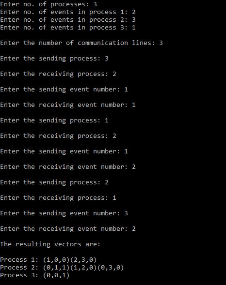

# lamports-vector-clock
C++ implementation of Lamport's Vector Clock Algorithm

A vector clock is an algorithm for generating a partial ordering of events in a distributed system and detecting causality violations. Just as in Lamport timestamps, interprocess messages contain the state of the sending process's logical clock. A vector clock of a system of N processes is an array/vector of N logical clocks, one clock per process; a local "smallest possible values" copy of the global clock-array is kept in each process

## Output

